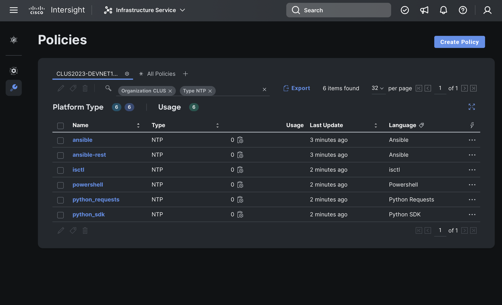

# Intersight API Snooping for Fun and Profit
## Cisco Live US 2023
## DEVNET-1061

This repo has example code used in DEVNET-1061 as delivered during Cisco Live US in 2023.  The intention of this code is to provide a set of examples in various automation languages/tools that a new user of the Intersight API can reference to begin their journey.

# Either install the prerequisites
It's perfectly reasonable to install the required prerequisites to execute this code on any unix-like system, such as Linux or macOS.  I'd suggest building a Linux VM somewhere if you don't have one already.  Either [Red Hat Enterprise Linux (free for developers)](https://developers.redhat.com/products/rhel/overview) or [Ubuntu (always free)](https://ubuntu.com/download/server) are well-supported choices.  This can be done from Windows as well, although some of the scripting here expects a BASH-like shell.

### Terraform Provider
https://registry.terraform.io/providers/CiscoDevNet/intersight/latest

### Ansible Collection
https://docs.ansible.com/ansible/latest/collections/cisco/intersight/index.html

### Python SDK
https://pypi.org/project/intersight/

### Python Requests Module
https://pypi.org/project/intersight-auth/

### PowerShell
https://www.powershellgallery.com/packages/Intersight.PowerShell/

### isctl CLI
https://github.com/cgascoig/isctl

# Authentication with API Keys

Intersight uses an API key to sign the headers of API calls instead of using a username and password.  The process for generating API keys is documented in many other places.

https://intersight.com/apidocs/introduction/security/#generating-api-keys

https://developer.cisco.com/learning/modules/intersight-rest-api/cisco-intersight-rest-api-keys/introduction-to-the-cisco-intersight-rest-api/

The API key comes in two parts…

The API key identifier is not secret, and in this repository we store this value in the [`key.id`](key.id) file.

The API key (sometimes called the private key) is a secret, and we store this in the [`key.pem`](key.pem) file.  It is indeed a [PEM](https://en.wikipedia.org/wiki/Privacy-Enhanced_Mail) file and contains a cryptographic key that was issued by Intersight.

Non-functioning samples for both are provided in this repository.  Once you download the files in this repository, please replace these two files with the API key that you have generated.  If you do so, you may safely ignore the rest of the explanation of API Keys that is provided below, but you are welcome to continue if you are interested.  This API key needs to be made available to the various languages/tools that we can use, and each one is somewhat different.  

***Regardless of which language/tool you use, you should not store the [`key.pem`](key.pem) in plain text, as we have in this educational activity.***

## Terraform

Terraform accesses the API keys via [input variables](https://developer.hashicorp.com/terraform/language/values/variables).  These could be passed in many ways, including the `-var` argument on the command line, from a .tfvars file, or from environment variables.  The example in this repository will use environment variables.  See the [`vars.sh`](vars.sh) file for the environment variables that start with `TF_VAR_`.

## Ansible

Ansible can access the API keys from environment variables or from a file.  The example in this repository will use environment variables.  See the [`vars.sh`](vars.sh) file for the environment variables that start with `INTERSIGHT_API_`.

## Python SDK

The Python SDK always wants to read the API key from a file, but the API Key ID can come from anywhere.  The example in this repository will use an environment variable to get the API Key ID (`api_key_id = os.environ['INTERSIGHT_API_KEY_ID']`) while the API key is read from a file (`private_key_path=api_secret_file`).  The large block of `if... elif` in that section of code checks the private key to see which type is provided to set the cryptography parameters correctly.

## Python Requests

The `intersight-auth` module for Requests can accept the API key either as a string or as a file.  The example in this repository will use environment variables to get both.  Again, see the [`vars.sh`](vars.sh) file.

```python
api_key_id = os.environ['INTERSIGHT_API_KEY_ID']
api_key = os.environ['INTERSIGHT_API_PRIVATE_KEY']
```

## PowerShell

The PowerShell cmdlets for Intersight must be configured via a cmdlet.  See [`configure_powershell.ps1`](configure_powershell.ps1) for the syntax.  The example in this repository will use an environment variable to get the API Key ID (`ApiKeyId = (Get-item -Path env:\INTERSIGHT_API_KEY_ID).Value`) while the API key is read from a file (`ApiKeyFilePath = "./key.pem"`).

Additionally, an interactive configuration can be performed from the command line by executing the `Intersight-Configure` cmdlet from within PowerShell.

## isctl

The isctl configuration file is stored in `~/.isctl.yaml` and [configure_isctl.sh](configure_isctl.sh) will automate that configuration in this repository.  The API key ID will be stored in the YAML file, as will the file name of the API key.  The API key will be accessed from the referenced file.

Additionally, the isctl executable has an interactive configuration that can be performed from the command line by executing `isctl configure`.

# Executing this sample code

After surviving a long explanation of prerequisites and API keys, you are now ready to execute the examples provided by this repository.  This will immediately fail if you don't have an [Organization in Intersight](https://intersight.com/help/saas/resources/RBAC#organizations) named `CLUS`.  Please go create it now.  This ensures that the names of the NTP policies that this code will create cannot possibly conflict with any existing policy.  If you are using a shared account that already has a CLUS organization…  Maybe one of your peers beat you to this point!

If you've put your API keys in the right place, all you need to do is execute [`ntp_all.sh`](ntp_all.sh) and it should start happening!



*NTP Policies deployed from various languages/tools*
